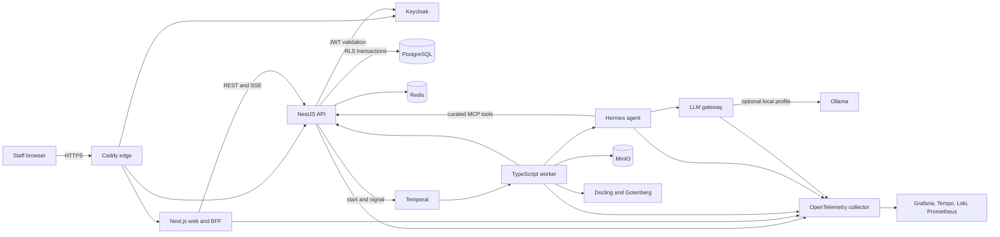

# Kid-OS

[](https://github.com/Ayo-faks/kid-os/actions/workflows/ci.yml)
[](LICENSE)
[](#project-status)

Kid-OS is an open-source operations platform for multi-home residential child
care. It brings incident reporting, resident timelines, handovers, approvals,
rota analysis, document processing, reporting, and auditable automation into a
single self-hostable system.

The project is designed around safety boundaries that do not depend on an AI
model behaving correctly: NestJS owns domain state, PostgreSQL row-level
security enforces tenant and home isolation, audit events are append-only, and
high-risk actions require deterministic human approval.

> [!WARNING]
> Kid-OS is pre-release software. It is not certified for production
> safeguarding, UK GDPR, Ofsted, NHS, medical, legal, or other regulatory use.
> Use synthetic data only while evaluating or contributing to the project.

## What It Includes

- Incident drafts, schema validation, approval routing, exports, and resident
  timeline entries.
- Shift-end handovers with follow-up tasks and durable workflow orchestration.
- Sensitive email drafting with role-aware dual sign-off.
- Deterministic rota gap analysis and separately authorized publishing.
- Verified document upload, Docling extraction, retention, and export bundles.
- Mattermost and notification integration points for staff workflows.
- Provider-neutral AI through one privacy and budget-controlled LLM gateway.
- OpenTelemetry traces, metrics, and logs through Grafana, Tempo, Prometheus,
  and Loki.

## Architecture



The detailed [architecture guide](docs/architecture.md) explains component
ownership, request and workflow paths, data stores, trust boundaries, failure
modes, and the compatibility-first naming policy.

## Quick Start

### Prerequisites

- Git
- Docker Engine or Docker Desktop with Compose v2
- OpenSSL, recommended so the helper can generate local secrets
- Enough local resources to build and run a multi-container stack

Node 24, pnpm 10, and Python 3.11 are also required for host-side development
and tests, but not for the Compose-only start below.

### Start the Core Stack

```bash
git clone https://github.com/Ayo-faks/kid-os.git
cd kid-os
./scripts/dev-up.sh
```

On first run, the helper:

1. creates `.env` from `.env.example`;
2. replaces local `change-me` secrets when OpenSSL is available;
3. builds and starts the default Compose services;
4. applies all Prisma migrations and loads synthetic demo data; and
5. waits for health checks before printing endpoints and credentials.

The initial build downloads several pinned images and can take a few minutes.
Open <https://localhost>, accept the local Caddy certificate warning, and sign
in with:

```text
Username: manager@careos.local
Password: careos-dev-password
```

The `careos` name remains in local identities and internal protocols during the
compatibility-first Kid-OS rename.

### Verify the Stack

```bash
./scripts/dev-up.sh --status
curl -kfsS https://localhost/health
curl -kfsS https://localhost/api/ready
```

Expected local services:

| Service       | URL                                | Local credentials                             |
| ------------- | ---------------------------------- | --------------------------------------------- |
| Kid-OS web    | <https://localhost/>               | Seeded user above                             |
| API health    | <https://localhost/api/health>     | None                                          |
| Keycloak      | <https://localhost/keycloak/>      | `admin` / `KEYCLOAK_ADMIN_PASSWORD` in `.env` |
| Temporal UI   | <https://localhost/temporal/>      | None                                          |
| Grafana       | <https://localhost/grafana/>       | `admin` / `GRAFANA_ADMIN_PASSWORD` in `.env`  |
| MinIO console | <https://localhost/minio-console/> | `careos` / `MINIO_ROOT_PASSWORD` in `.env`    |

For complete setup, optional profiles, logs, selective rebuilds, shutdown,
reset, and troubleshooting, see [Getting Started](docs/getting-started.md).

## Optional Local AI

The core stack starts without downloading a model. To run the pinned local
Ollama model as well:

```bash
COMPOSE_PROFILES=llm ./scripts/dev-up.sh
```

Model-backed features remain behind `llm-gateway`; application services and
Hermes do not call model providers directly.

## Development

Install host dependencies after cloning:

```bash
pnpm install --frozen-lockfile
pnpm lint
pnpm typecheck
pnpm test
pnpm build
pnpm test:agent
```

Useful commands:

| Command                          | Purpose                                              |
| -------------------------------- | ---------------------------------------------------- |
| `./scripts/dev-up.sh api web`    | Rebuild and restart selected services                |
| `./scripts/dev-up.sh --no-build` | Start without rebuilding images                      |
| `./scripts/dev-up.sh --down`     | Stop containers and preserve data volumes            |
| `./scripts/dev-up.sh --nuke`     | Stop containers and permanently delete local volumes |
| `./scripts/compose-smoke.sh`     | Build a disposable stack and verify core integration |
| `pnpm ci:open-source:public`     | Check that private operations content is absent      |
| `pnpm ci:supply-chain`           | Validate pinned images, Actions, and Python locks    |

## Repository Map

```text
apps/
  web/             Next.js application, BFF routes, and Playwright tests
  api/             NestJS domain API, Prisma schema, migrations, and OpenAPI
  worker/          Temporal and optional Durable Task workflows and activities
  agent/           Python Hermes service, prompts, skills, and tool adapters
  llm-gateway/     Provider routing, PII redaction, budgets, and telemetry
packages/
  contracts/       Shared workflow and API contracts
  schemas/         Versioned JSON Schema forms and runtime validation
  object-storage/  MinIO and Azure Blob provider boundary
  ui/              Shared UI primitives
infra/
  compose/         Local deployment topology
  keycloak/        Development realm, roles, clients, and synthetic users
  caddy/           Local TLS edge and reverse proxy
  otel/             Telemetry collection
  grafana/          Dashboards and datasource provisioning
```

## Safety Invariants

- Every tenant/home data path sets transaction-local PostgreSQL context before
  accessing RLS-protected data.
- `audit.events` is append-only; application code must never update or delete
  audit rows.
- Hermes changes domain state only through the curated NestJS MCP surface.
- All model traffic goes through `llm-gateway` for service authentication, PII
  redaction, budgets, and telemetry.
- AI output is advisory. Safeguarding routing and approval thresholds are
  deterministic application policy.
- Tests, screenshots, issues, and pull requests must contain synthetic data
  only.

See [SECURITY.md](SECURITY.md) and
[docs/phase4-hardening.md](docs/phase4-hardening.md) for the current security
posture and remaining production hardening work.

## Project Status

The source is public for evaluation, learning, and collaboration. The
third-party distribution review is still in progress, so Kid-OS does not yet
publish a supported binary, container bundle, managed service, or production
release. Private deployment automation and live environment evidence are
intentionally outside this repository.

Legacy `careos` package, protocol, identity, database, workflow, storage, and
telemetry identifiers remain compatibility surfaces. Do not globally replace
them without a migration and rollback plan.

## Contributing

Read [CONTRIBUTING.md](CONTRIBUTING.md) before opening a pull request. Commits
use Conventional Commits and require a [DCO](DCO) sign-off. Please report
vulnerabilities through the private channel described in
[SECURITY.md](SECURITY.md), never through a public issue.

## License

Kid-OS-owned source is licensed under the [Apache License 2.0](LICENSE).
Containers, dependencies, and model artifacts retain their upstream licenses;
see [THIRD_PARTY_NOTICES.md](THIRD_PARTY_NOTICES.md) before redistributing a
bundled deployment. The project name and marks are covered separately by
[TRADEMARKS.md](TRADEMARKS.md).
