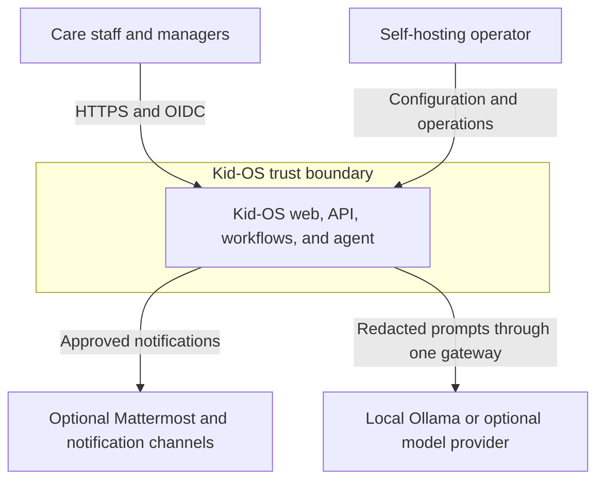
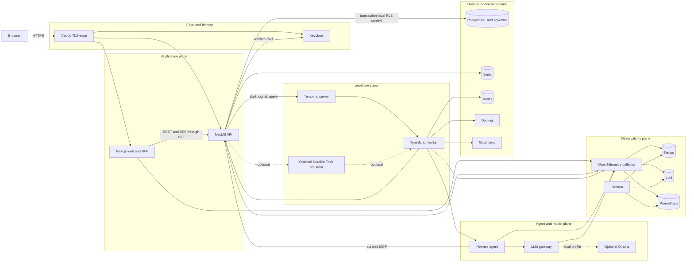
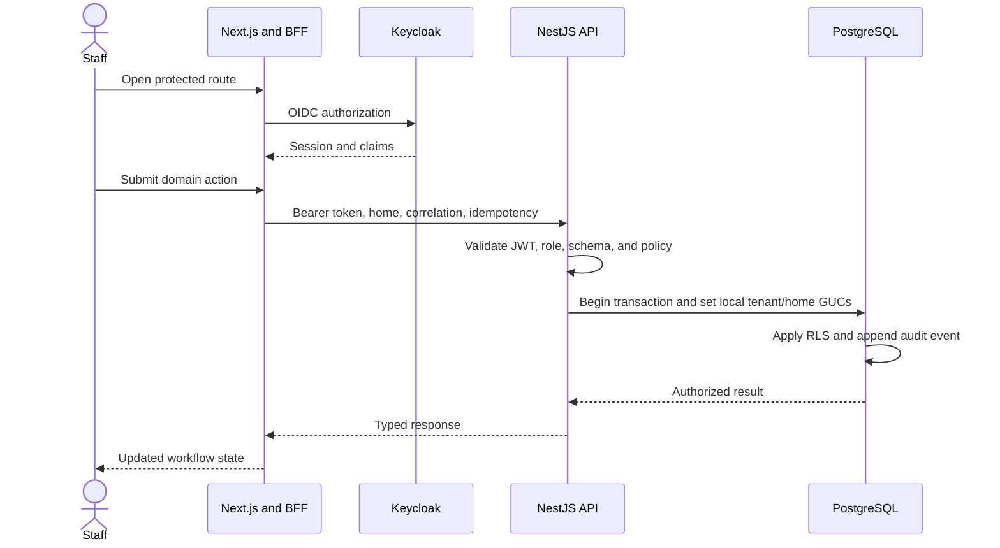
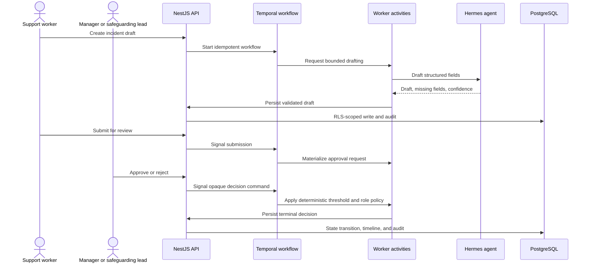

# Kid-OS Architecture

This document describes the current public source architecture. It is intended
for contributors, reviewers, and operators evaluating the local Compose stack.
It is not evidence that any particular deployment is secure or compliant.

## Design Goals

Kid-OS is built for workflows where confidentiality, accountability, and human
oversight matter more than autonomous behavior. The architecture therefore
keeps five responsibilities separate:

1. user experience and session-aware BFF routing;
2. domain authorization and state ownership;
3. deterministic durable workflow execution;
4. bounded agent and model assistance; and
5. telemetry and operational diagnostics.

## System Context

The public project does not provide a managed service. Operators own their
deployment, identity configuration, backups, incident response, and regulatory
assessment.

## Container Architecture

## Component Responsibilities

| Component               | Owns                                                                                          | Must not own                                                       |
| ----------------------- | --------------------------------------------------------------------------------------------- | ------------------------------------------------------------------ |
| Next.js web             | User interface, session handling, BFF proxy routes, SSE client                                | Domain authorization or direct database access                     |
| NestJS API              | Domain rules, RBAC, request validation, tenant context, idempotency, audit, MCP tool boundary | Long-running retry state or direct model-provider calls            |
| PostgreSQL              | Canonical domain state, row-level security, append-only audit records                         | Workflow scheduling                                                |
| Redis                   | Idempotency and bounded operational cache/budget state                                        | Canonical resident or incident state                               |
| Temporal / Durable Task | Retryable orchestration, timers, signals, human waits, workflow ownership                     | Sensitive free text in scheduler metadata where opaque IDs suffice |
| Worker                  | Activities, side-effect coordination, document/export processing                              | Bypassing the API's domain boundary                                |
| Hermes                  | Bounded drafting, extraction, narration, and tool selection                                   | Direct database writes or approval decisions                       |
| LLM gateway             | Provider translation, service authentication, PII redaction/rehydration, budgets, telemetry   | Domain state or approval authority                                 |
| MinIO                   | Local object storage for documents and bundles                                                | Domain authorization decisions                                     |
| OpenTelemetry stack     | Traces, metrics, and operational logs                                                         | Raw resident data by design                                        |

## Request and Identity Path

1. The browser reaches one HTTPS edge at Caddy.
2. NextAuth uses the Keycloak `careos` realm for user authentication.
3. Browser application calls use session-aware Next.js BFF routes where
   appropriate; service routes are proxied to NestJS.
4. NestJS validates the token audience and extracts tenant, permitted homes,
   user, and role claims.
5. Each data operation opens a transaction and sets the request context as
   transaction-local PostgreSQL GUCs.
6. RLS policies enforce tenant/home visibility at the database layer even if an
   application query is broader than intended.
7. Mutations carry idempotency and correlation identifiers and produce audit
   evidence.

## Durable Workflow Path

Temporal is the default local workflow runtime. Selected workflow families also
have an optional Durable Task implementation, but runtime ownership must be
explicit and persisted; the two engines must not race to own the same workflow.

For an incident requiring review:

The model never decides whether a safeguarding route or approval threshold is
required. Those decisions come from application policy, templates, roles, and
validated fields.

## Agent and LLM Boundary

Hermes has two constrained outbound paths:

- curated MCP tools exposed by NestJS for domain reads and writes;
- the internal `llm-gateway` for model inference.

The gateway authenticates service calls, maps logical tasks to a configured
provider, redacts supported PII before provider egress, rehydrates responses,
applies tenant budgets, and emits telemetry. Ollama is available through an
optional local Compose profile. Cloud adapters are optional and must remain
behind the same gateway.

No application service or Hermes tool may directly dial an LLM provider SDK.

## Data Stores

| Store                 | Data                                                                                                 | Isolation and integrity                                                          |
| --------------------- | ---------------------------------------------------------------------------------------------------- | -------------------------------------------------------------------------------- |
| PostgreSQL            | Tenants, homes, users, residents, incidents, approvals, handovers, rota, documents, retention, audit | RLS on tenant/home tables; transaction-local context; append-only audit triggers |
| Redis                 | Idempotency cache, rate/budget state                                                                 | Namespaced keys; not the canonical domain store                                  |
| MinIO                 | Uploaded documents and generated export bundles                                                      | Tenant/home-scoped object keys; API verifies metadata before workflow start      |
| Temporal              | Workflow histories, timers, signals                                                                  | Payload policy favors opaque IDs and command references                          |
| Tempo/Loki/Prometheus | Traces, logs, metrics                                                                                | Telemetry must not become an alternate store for sensitive domain payloads       |

## Trust Boundaries and Invariants

### Domain state

- NestJS is the only application owner of domain state.
- Hermes and workflow activities do not write directly to domain tables.
- Every write endpoint is validated and idempotent.

### Tenant isolation

- Tenant and home context is set inside the same database transaction as the
  query.
- Session-scoped database context is prohibited because pooled connections can
  leak state between requests.
- System sweeps use explicit, audited system context rather than bypassing RLS.

### Audit

- `audit.events` is append-only.
- Database triggers cover high-value state transitions in addition to HTTP
  interception.
- Source configuration proves a control exists; it does not prove a deployment
  executed that control.

### Human authority

- AI-generated data remains a draft until validated and confirmed.
- Sensitive email and safeguarding approval policies require role-aware human
  decisions.
- A refusal or unavailable provider must never be presented as successful
  delivery.

## Local Deployment Topology

The default Compose deployment uses one internal network. Caddy is the browser
edge; most services are not published directly to the host. Keycloak retains a
development port for administration, while optional Mattermost and Durable Task
profiles expose their documented ports when enabled.

One-shot bootstrap services apply migrations, seed synthetic data, initialize
object-storage buckets, and optionally pull the pinned local model. Health
dependencies prevent the API, web, and worker from claiming readiness before
their required infrastructure is ready.

See [Getting Started](getting-started.md) for exact commands and endpoints.

## Observability

Application services emit OpenTelemetry data to a collector. The local stack
routes:

- traces to Tempo;
- logs to Loki; and
- metrics to Prometheus.

Grafana provides a single inspection surface. Correlation identifiers connect
browser, API, workflow, agent, and gateway activity without requiring sensitive
payloads in telemetry.

## Extension Points

- Add a form by versioning JSON Schema and UI Schema in `packages/schemas`.
- Add a workflow contract in `packages/contracts`, then implement engine and
  activity behavior in `apps/worker`.
- Add an object store through the provider boundary in
  `packages/object-storage`.
- Add a model provider only inside `apps/llm-gateway`.
- Add an agent capability as a bounded Hermes skill backed by curated MCP
  operations.

Changes to identity claims, RLS context, audit behavior, workflow ownership,
approval policy, provider egress, or persisted identifiers require an
architecture discussion and migration plan.

## Compatibility-First Rename

Kid-OS is the public product name. Existing `careos` identifiers remain in npm
package names, environment variables, headers, the Keycloak realm, database
roles, queues, schedules, schema IDs, storage keys, and telemetry attributes.
They are compatibility identifiers, not stale text to replace mechanically.

A future rename must use dual readers or aliases, migrate persisted state,
validate in-flight workflows, and retain a rollback path.

## Further Reading

- [Getting Started](getting-started.md)
- [Security Policy](../SECURITY.md)
- [Hardening Status](phase4-hardening.md)
- [Architecture Decisions and Roadmap](plan.md)
- [Contribution Guide](../CONTRIBUTING.md)
